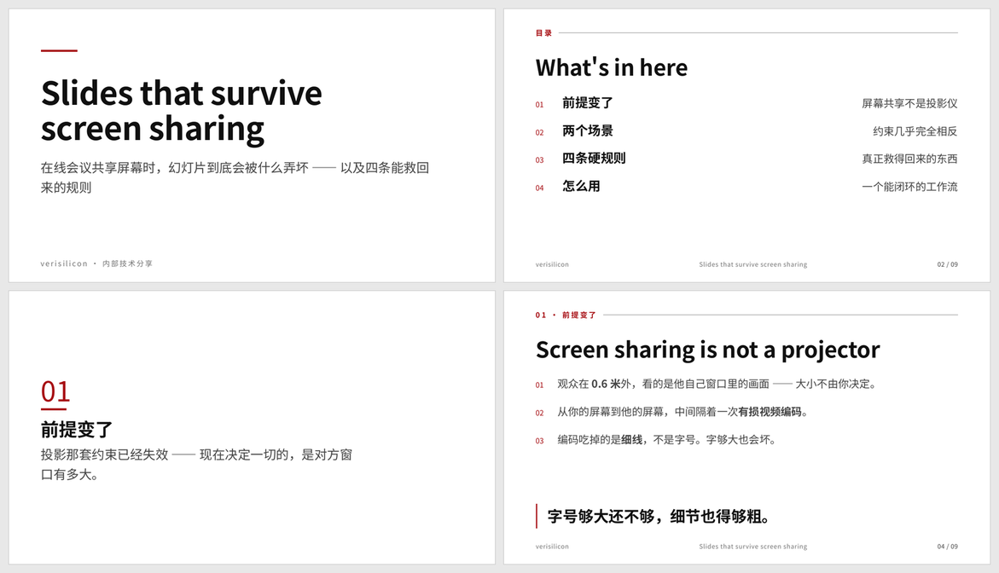

# JerrySlide

**在线会议共享屏幕用的 HTML slide** —— 单文件、离线可用、一条命令导出 PDF。

> 你在自己屏幕上精心调出来的那条 1px 分隔线，
> **在对方的会议窗口里根本不存在。**



---

## 为什么会有这个东西

不是审美偏好。是**实测出来的物理事实**。

做第一份 deck 的时候，我发现几件「看着没问题、实际上会坏」的事。它们有一个共同点：
**全部在屏幕上看不出来，全部是真的会坏。**

### ① 1px 的分隔线在会议里会消失

你屏幕上是条精致的 1px 灰线。对方看到的是**被 H.264 压过、缩小到他窗口里的**画面。

| 线 | 压缩后还剩多少对比度 |
|---|---|
| **1px `#d0d0d0`（最常见的写法）** | **4%** ← 等于没有 |
| 2px 同色 | 51% |
| 2px 更深的灰 | 79% |
| **改用底色块**（根本不用线） | 比线抗压 **20 倍** |

**线宽比颜色重要。能用面就别用线。**

### ② 字体不内联，PDF 会碎

用系统字体会出三件事：对方没装 → 换行全变 → 页面溢出；而如果用的是**可变字体**
（macOS 的苹方就是），PDF 里没有它的表示 → 浏览器把它**转成一个个小图形** →
文件大 6 倍、文字不能搜索、打印发糊。

**解法：切片后内联。** 中文完整字体 16.9 MB，但一份 deck 只用约 300 字 ——
切完只有 300 KB。

### ③ 浅颜色会塌成一片

设计上用了三个「层次」：`#fcfcfd` `#fafafa` `#f6f6f6`。
压完 **全部变成同一个 (252,252,252)** —— 层次没了，看着像忘了画。

实测出了可用的台阶：最浅能用的面是 `#f2f2f2`，每级差 5–6 个灰阶。
带色偏的（淡红等）能保住颜色。

### ④ 阴影和渐变会在 PDF 里留软掩码

`box-shadow` / `linear-gradient` 屏幕上没事，导出 PDF 时浏览器会生成透明度遮罩。
某些阅读器和打印机上会露出灰底。

### ⑤ 放不下的时候，本能是缩字号 —— 那是禁止的

字号不是审美选择，是**从「对方窗口有多宽」推出来的**：

```
u = 17.5 × 1280 / 最窄要支持的窗口宽度 = 22400 / Sv
```

`u = 28px`（对应 800px 窗口）。**模板里所有尺寸都是它的倍数。**

AI 的天性是把字号调小来"帮你保住内容" —— **那等于拆掉整个体系的前提。**
所以规则是：**放不下就删字。**

---

## 它是什么

一套**能做、能验、能复现**的 slide 系统：

| | |
|---|---|
| **规范** | 每条规则背后都有一次实测（`references/RULES.md`，1100 行） |
| **模板** | 12 页零件库，58 个零件，每个都有示范页 |
| **工具** | 6 个脚本：起手 / 改页 / 一条命令构建 / 机械验收 / 零件清单 |
| **验收** | `check.py` 拦 9 类「错了但不报警」的问题 |
| **经验** | `references/FAILURES.md` —— 15 条静默失败 + 5 条被证伪的假设 |

### 它长什么样

- **中英混排**，英文大标题 + 中文正文
- 学术简约风：白底 + 黑 + 品牌红
- **绝不用 `box-shadow` / `linear-gradient`**
- **一次按键一页**，没有逐元素动画
- **零外链**，双击就能放，不联网

---

## 安装

这是给 [pi](https://github.com/badlogic/pi-mono) 用的 skill：

```bash
git clone <this-repo> ~/.pi/agent/skills/jerryslide
```

然后在会话里用 **`/skill:jerryslide`** 唤起。

**它是显式入口**（`disable-model-invocation: true`）—— agent 不会自己想到用它。
理由：这套规范的前提很窄，**在前提之外它不是中性的，它会主动害人**。
（拿去做投影 deck，`u` 的整套推导都是错的。）

第一次用会跑一次环境体检，缺什么当场说：

```bash
./scripts/build.sh --doctor          # 只读，不碰任何文件
./scripts/build.sh --doctor --fix    # 顺手建 venv / 下字体
```

依赖：**Python 3** · **Chrome 或 Chromium** · `curl`。

---

## 用法

```bash
# ① 起手（第二个参数是 deck 的 <title>）
./scripts/newdeck.py 我的deck.html "我的 deck 全名"

# ② 页面抽出来改 —— 抽出来 10 KB，原文件 450 KB
./scripts/setpages.py 我的deck.html --extract
#     编辑 我的deck.pages.html

# ③ 贴回去
./scripts/setpages.py 我的deck.html

# ④ 字体 → PDF → 验收，一条命令
./scripts/build.sh 我的deck.html
```

### 为什么页面要抽出来改

一份 deck 是 450 KB，其中 400 KB 是内联字体的 base64。
在里面找锚点很难受 —— **而且锚点找错是静默吞内容的**。

`setpages.py` 保证**边界以外逐字节不动**：抽出来再贴回去，文件指纹完全相同。
写盘前自检五项，任何一条不过就不写文件。

---

## 验收查什么

```
✓ 零外部引用（离线可用）
✓ 没有 box-shadow / linear-gradient
✓ 字体子集覆盖了所有在用的字   ← 改文字忘了重跑字体 = 新字静默掉回系统字体
✓ 每页装得下（溢出 / 余量不足 / 半页空着）
✓ PDF 里没有 Type 3、没有软掩码
✓ <title> 不是模板的默认值
✓ 零件库有没有漂移（定义了但没示范 / 用了但没定义）
```

**这些全是「屏幕上看不出来」的错** —— 所以必须机械检查，不能靠记得。

---

## 铁律（摘要）

1. **不用 1px 线** —— 用底色块，面比线抗压 20 倍
2. **不用 `box-shadow` / `linear-gradient`** —— PDF 里会出软掩码
3. **字体必须切片后内联** —— 否则换行变 + PDF Type 3
4. **改完文字必须重跑字体子集化** —— 漏跑是静默的
5. **放不下就删字，不许缩字号** ← 最反本能的一条
6. **一份 deck 只用一个底色** —— 不许逐页切深浅
7. **面的色偏 ≥ 20 或灰阶差 ≥ 6** —— 否则压完塌成一色
8. **专有名词保留英文原名**，自己造的比喻用中文
9. **标题是可证伪的断言**，不是名词短语
10. **页数由时间定**，不由内容定

**冻结线：页面结构你可以加，令牌值不要动。**

---

## 目录

```
SKILL.md                    常驻说明书（≤200 行）
references/
  RULES.md                  完整规范 + 推导 + 实测数据 ← 唯一真相源
  BUILD.md                  怎么跑（手动五步 + 四个坑）
  FAILURES.md               ★ 静默失败清单 F1–F11 + 被证伪的假设
scripts/
  build.sh · check.py · build_font.py
  newdeck.py · setpages.py · parts.py
assets/
  template.html             12 页零件库（46 KB，字体运行时注入）
  demo.html                 用模板做的成品
  tests/                    反向用例
docs/
  PLAN.md                   决策记录：为什么这么定、否决了什么
  SKILL-NOTES.md            把它做成 skill 的判断
  PACKAGING.md              打包计划与执行记录
  preview.png
  pack.py                   从 _theme/ 开发工作区重新组装这个 repo —— 它读的是
                            _theme/ 里的源文件，不能在这里跑
```

---

## 它被验证到什么程度

**四轮冷启动测试**：干净目录 + 全新会话 + 一句话题目 + 零提示。

| 测试 | 结果 |
|---|---|
| 正常使用 | 产出 10 页 deck，全部检查通过，**主动应用了铁律 5** |
| 不显式调用 + 投影场景 | **完全没用到这套规范** —— 它自己做主了明暗主题切换（投影下那是对的） |
| 显式调用 + 投影场景 | **拒绝**，并自己重推了投影的物理公式，产出 0 个文件 |
| 环境缺字体 | `--doctor` 报出来，它自己修好 |

**两次冷启动测试各找到一个工具 bug** —— 这个方法本身是有效的。

在用的真实 deck：`什么是 Agent`（10 页）、`为什么需要 Reviewer`（8 页）。

---

## 已知的洞

**内容层没有成文。**

只装模板的 skill，产出会是「**排版精良、什么也没说**」的 deck ——
这个失败模式比排版难看更隐蔽，**因为它一眼看去是合格的**。

理由：它**不可机械验证**，只能在使用中收敛。所以它写成建议，不是铁律。

---

## 字体

`build_font.py` 首次运行时从 Google Fonts 下载 **Noto Sans SC 变量字体**（16.9 MB，
OFL 授权）到 `~/.cache/slide-fonts/`，之后一直复用。

**仓库里不含字体** —— 模板是剥过字体的版本。这顺带保证了一件事：
**不跑构建脚本就出不了 PDF**，从机制上不可能忘记重跑字体子集。
